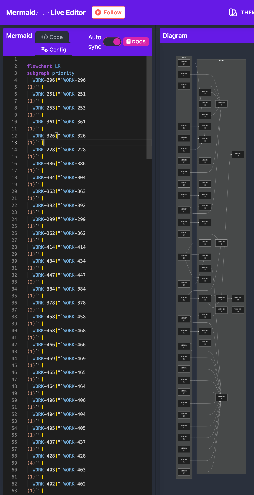

# linear-pert

Create PERT-style charts (in mermaid.js syntax) from Linear projects.

## Setup

Set up Node and pnpm:

```
nvm install 22.7.0
nvm use 22.7.0
npm i -g pnpm@9.8.0
pnpm i
```

Create a Linear Personal API Key: https://linear.app/vercel/settings/api

Save the token in `.env`:

```
echo LINEAR_API_KEY=YOU_API_KEY_HERE > .env
```

## Usage

Go to a Linear project URL, like:

https://linear.app/my-cool-org/project/some-neat-project-23a95145d3ac/issues

Pull out the ID from the slug: `23a95145d3ac`.

Then run:

```
pnpm start 23a95145d3ac
```

### `--show-actionable`

By default, this process will not show stand-alone issues. The make the graph harder to read.

If you want to see them anyway, add the `--show-actionable` flag.

```
pnpm start 23a95145d3ac --show-actionable
```

## Output

```
$  pnpm start 23a95145d3ac

> linear-pert@1.0.0 start /Users/smassa/source/endangeredmassa/linear-pert
> ts-node ./src/index.ts "23a95145d3ac"

! fetching issues
! determining workflow
! building graph

------

flowchart LR
subgraph priority
  WORK-296["`WORK-296
(1)`"]
  WORK-251["`WORK-251
(1)`"]
  WORK-253["`WORK-253
(1)`"]
  WORK-361["`WORK-361
(1)`"]
  WORK-326["`WORK-326
(1)`"]
  WORK-228["`WORK-228
(1)`"]
  WORK-386["`WORK-386
(1)`"]
  WORK-304["`WORK-304
(1)`"]
  WORK-363["`WORK-363
(1)`"]
  WORK-392["`WORK-392
(1)`"]
  WORK-299["`WORK-299
(1)`"]
  WORK-362["`WORK-362
(1)`"]
  WORK-414["`WORK-414
(1)`"]
  WORK-434["`WORK-434
(1)`"]
  WORK-447["`WORK-447
(2)`"]
  WORK-384["`WORK-384
(1)`"]
  WORK-378["`WORK-378
(2)`"]
  WORK-458["`WORK-458
(1)`"]
  WORK-468["`WORK-468
(1)`"]
  WORK-466["`WORK-466
(1)`"]
  WORK-469["`WORK-469
(1)`"]
  WORK-465["`WORK-465
(1)`"]
  WORK-464["`WORK-464
(1)`"]
  WORK-406["`WORK-406
(1)`"]
  WORK-404["`WORK-404
(1)`"]
  WORK-405["`WORK-405
(1)`"]
  WORK-437["`WORK-437
(1)`"]
  WORK-428["`WORK-428
(4)`"]
  WORK-403["`WORK-403
(1)`"]
  WORK-402["`WORK-402
(1)`"]
end
subgraph blocked
  WORK-361["`WORK-361
(1)`"] --> WORK-308["`WORK-308
(1)`"]
  WORK-299["`WORK-299
(1)`"] --> WORK-360["`WORK-360
(1)`"]
  WORK-251["`WORK-251
(1)`"] --> WORK-252["`WORK-252
(1)`"]
  WORK-139["`WORK-139
(1)`"] --> WORK-252["`WORK-252
(1)`"]
  WORK-488["`WORK-488
(1)`"] --> WORK-252["`WORK-252
(1)`"]
  WORK-299["`WORK-299
(1)`"] --> WORK-252["`WORK-252
(1)`"]
  WORK-304["`WORK-304
(1)`"] --> WORK-252["`WORK-252
(1)`"]
  WORK-494["`WORK-494
(1)`"] --> WORK-252["`WORK-252
(1)`"]
  WORK-253["`WORK-253
(1)`"] --> WORK-252["`WORK-252
(1)`"]
  WORK-296["`WORK-296
(1)`"] --> WORK-333["`WORK-333
(1)`"]
  WORK-228["`WORK-228
(1)`"] --> WORK-333["`WORK-333
(1)`"]
  WORK-326["`WORK-326
(1)`"] --> WORK-333["`WORK-333
(1)`"]
  WORK-386["`WORK-386
(1)`"] --> WORK-388["`WORK-388
(1)`"]
  WORK-362["`WORK-362
(1)`"] --> WORK-374["`WORK-374
(1)`"]
  WORK-363["`WORK-363
(1)`"] --> WORK-385["`WORK-385
(1)`"]
  WORK-392["`WORK-392
(1)`"] --> WORK-391["`WORK-391
(1)`"]
  WORK-384["`WORK-384
(1)`"] --> WORK-413["`WORK-413
(2)`"]
  WORK-417["`WORK-417
(1)`"] --> WORK-413["`WORK-413
(2)`"]
  WORK-414["`WORK-414
(1)`"] --> WORK-413["`WORK-413
(2)`"]
  WORK-424["`WORK-424
(3)`"] --> WORK-412["`WORK-412
(1)`"]
  WORK-412["`WORK-412
(1)`"] --> WORK-425["`WORK-425
(3)`"]
  WORK-434["`WORK-434
(1)`"] --> WORK-417["`WORK-417
(1)`"]
  WORK-412["`WORK-412
(1)`"] --> WORK-424["`WORK-424
(3)`"]
  WORK-384["`WORK-384
(1)`"] --> WORK-424["`WORK-424
(3)`"]
  WORK-378["`WORK-378
(2)`"] --> WORK-422["`WORK-422
(1)`"]
  WORK-422["`WORK-422
(1)`"] --> WORK-421["`WORK-421
(1)`"]
  WORK-412["`WORK-412
(1)`"] --> WORK-439["`WORK-439
(5)`"]
  WORK-458["`WORK-458
(1)`"] --> WORK-461["`WORK-461
(1)`"]
  WORK-434["`WORK-434
(1)`"] --> WORK-449["`WORK-449
(3)`"]
  WORK-447["`WORK-447
(2)`"] --> WORK-449["`WORK-449
(3)`"]
  WORK-468["`WORK-468
(1)`"] --> WORK-335["`WORK-335
(1)`"]
  WORK-434["`WORK-434
(1)`"] --> WORK-448["`WORK-448
(1)`"]
  WORK-378["`WORK-378
(2)`"] --> WORK-457["`WORK-457
(2)`"]
  WORK-468["`WORK-468
(1)`"] --> WORK-457["`WORK-457
(2)`"]
  WORK-404["`WORK-404
(1)`"] --> WORK-457["`WORK-457
(2)`"]
  WORK-406["`WORK-406
(1)`"] --> WORK-457["`WORK-457
(2)`"]
  WORK-469["`WORK-469
(1)`"] --> WORK-457["`WORK-457
(2)`"]
  WORK-403["`WORK-403
(1)`"] --> WORK-457["`WORK-457
(2)`"]
  WORK-428["`WORK-428
(4)`"] --> WORK-457["`WORK-457
(2)`"]
  WORK-465["`WORK-465
(1)`"] --> WORK-457["`WORK-457
(2)`"]
  WORK-512["`WORK-512
(1)`"] --> WORK-457["`WORK-457
(2)`"]
  WORK-466["`WORK-466
(1)`"] --> WORK-457["`WORK-457
(2)`"]
  WORK-405["`WORK-405
(1)`"] --> WORK-457["`WORK-457
(2)`"]
  WORK-402["`WORK-402
(1)`"] --> WORK-457["`WORK-457
(2)`"]
  WORK-437["`WORK-437
(1)`"] --> WORK-457["`WORK-457
(2)`"]
  WORK-464["`WORK-464
(1)`"] --> WORK-457["`WORK-457
(2)`"]
  WORK-421["`WORK-421
(1)`"] --> WORK-445["`WORK-445
(5)`"]
end


------

https://mermaid.live/edit#pako:eNqdmE9v00AQxb9KtCeQEsn7z971gROcACGVAxIYqW7sNlETO3IdQYjy3dkG0n1qZmWvL9Umffrt2_HszDhHtmyrmuWsaO437a_lquz62aebonna3z105W4123Xrtlv3h6KZzb59ufm4EDb9UbDby7po3vC3twX76QWae4HmlECCQF4LZOoJbk0IhPfg1sQWwvgthCEIBgiGIMhEeUGiKJMSTFKnsMILrCBMWguRtNQWQEgJguLepFsTAgkCSQlU5gUqcwLxOlAQB0PFIfOhdutrgtJe4NaEhxQEKSlIQZBSAgsCSwk0CDQlgEClVKAS8JBQHiBhVEISwENCeZDwLGRGCCCr1Tmr1estJGwhKQ8CBJhRdVPBrb_btMvHuhq8kbPF4t3lvkAaJGZ8tgMiTWCTZHxl8QihBSiIG8Old-HWUxDKwFMwZgpiOBaDiFB9ijmIhYy1kxChUh4VC7qfQF5IqLRSjq_2EYhQR4lBBFoKICBzpDHjCz4gMnjsWURbQhcaXOjxjQsQFsqBpRp0oGt4hOJQqrgk2gaHasizaQi6PcYgBCDEM0JeIaCkcrJJ0wJACOgMQr9sMtjG0QUdrSgX9FFjHuogIjAsIAJ8CiqcAQEiOCj4pFhAm1DnNqHHDTWAgJapqCF2xENV4EJZIi8C01sMIjB8YeGDeiH1tIPAJsqMHyIBoeGomhhUhw8yjAiMcFEIekyMOgg9zEa5oOfAGERg1ow6CD10RyA03FRN39RhF_TLQ1Q46ck9CkEP3jGIwOtBVCzot5yovKCLK152iJbSUDvdOwabs23dbct1xXJ2fKYWrF_V27pguVtWZfdYsKI5OV2579uvh2bJ8r7b13O231VlX79fl-4VZcvy-3Lz5L7dlc33tt1eRO4jy4_sN8uTOTu4v6c5-3P-P78QPlTrvu1eAPX54-d_P4Ocfw2Zs67dP6z-K05_AWYgm3s
```

Which will show:


